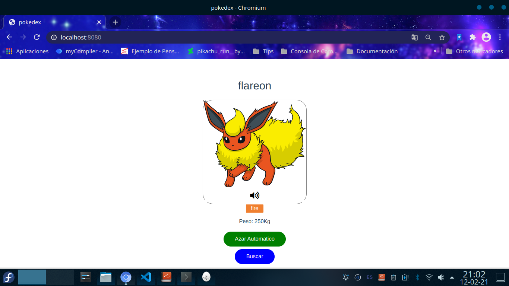

# Pokedex

Esta es una pequeña aplicación creada en vue, 
la cual muestra un pokemon de forma aleatoria .
>los datos y las imágenes son servidos por https://pokeapi.co/ y 
los sonidos por otras plataformas.
por otra parte probablemente algunos pokemones no tenga grito.




## Comandos necesarios 

``` bash
# Instalar dependencias
npm install

# Iniciar servidor en modo desarrollo
npm run dev

# Compilar el proyecto para producción (version min)
npm run build
```
